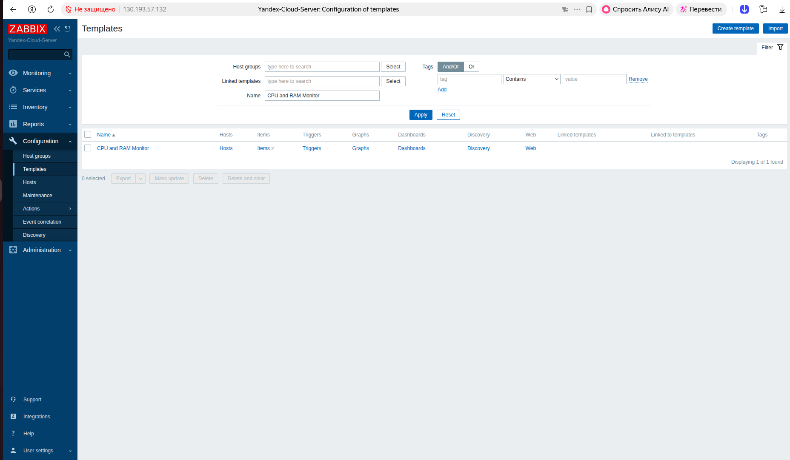
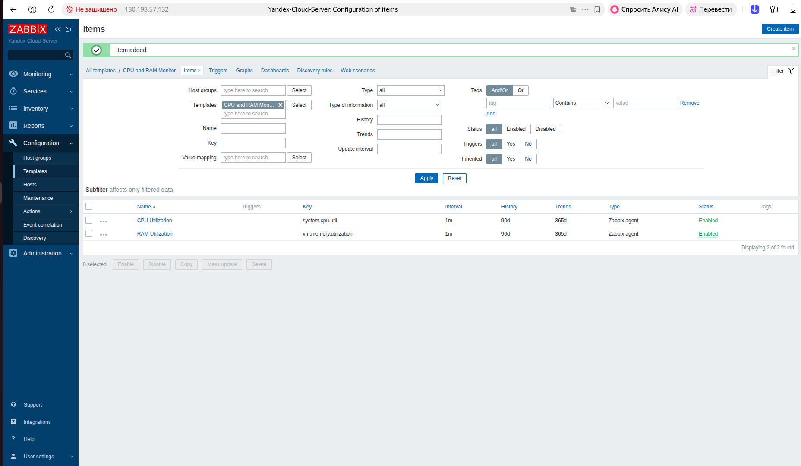
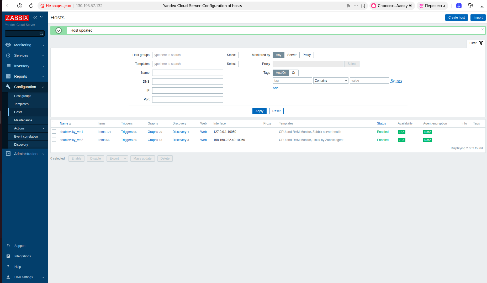
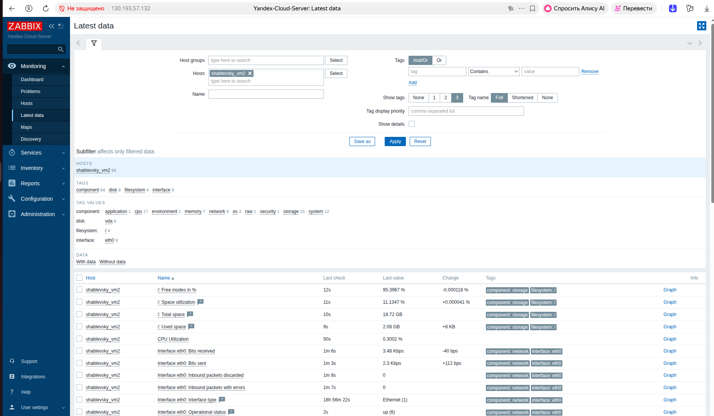
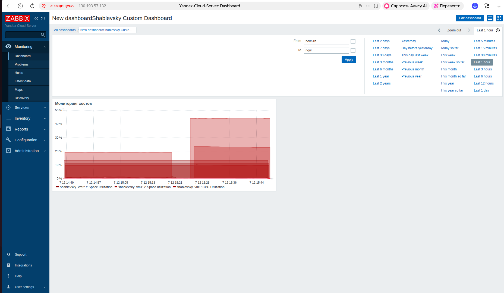
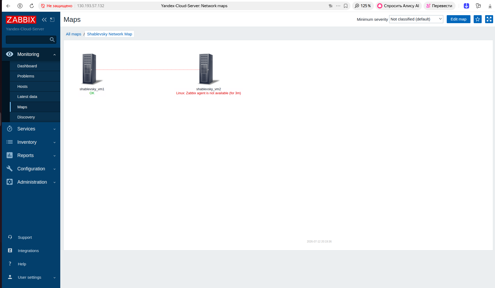
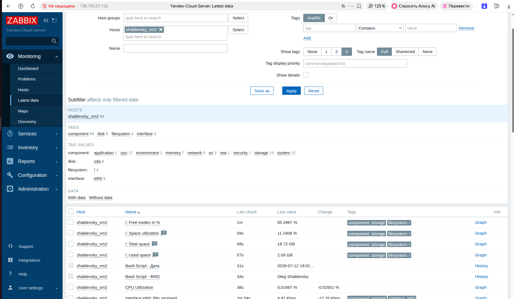
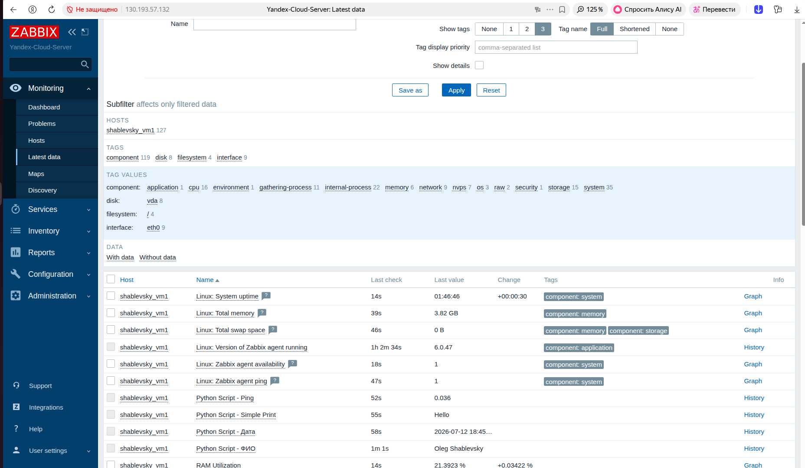

# Домашнее задание к занятию "`Система мониторинга Zabbix. Часть 2`" - `Шаблевский Олег`


---

### Задание 1

Создайте свой шаблон, в котором будут элементы данных, мониторящие загрузку CPU и RAM хоста.

### Процесс выполнения

1. Выполняя ДЗ сверяйтесь с процессом отражённым в записи лекции.
2. В веб-интерфейсе Zabbix Servera в разделе Templates создайте новый шаблон
3. Создайте Item который будет собирать информацию об загрузке CPU в процентах
4. Создайте Item который будет собирать информацию об загрузке RAM в процентах

#### Требования к результату

 Прикрепите в файл README.md скриншот страницы шаблона с названием «Задание 1»






---

### Задание 2

Добавьте в Zabbix два хоста и задайте им имена <фамилия и инициалы-1> и <фамилия и инициалы-2>. Например: ivanovii-1 и ivanovii-2.

#### Процесс выполнения
1. Выполняя ДЗ сверяйтесь с процессом отражённым в записи лекции.
2. Установите Zabbix Agent на 2 виртмашины, одной из них может быть ваш Zabbix Server
3. Добавьте Zabbix Server в список разрешенных серверов ваших Zabbix Agentов
4. Добавьте Zabbix Agentов в раздел Configuration > Hosts вашего Zabbix Servera
5. Прикрепите за каждым хостом шаблон Linux by Zabbix Agent
6. Проверьте что в разделе Latest Data начали появляться данные с добавленных агентов

#### Требования к результату
Результат данного задания сдавайте вместе с заданием 3


---

### Задание 3

Привяжите созданный шаблон к двум хостам. Также привяжите к обоим хостам шаблон Linux by Zabbix Agent.

#### Процесс выполнения
1. Выполняя ДЗ сверяйтесь с процессом отражённым в записи лекции.
2. Зайдите в настройки каждого хоста и в разделе Templates прикрепите к этому хосту ваш шаблон
3. Так же к каждому хосту привяжите шаблон Linux by Zabbix Agent
4. Проверьте что в раздел Latest Data начали поступать необходимые данные из вашего шаблона

#### Требования к результату
Прикрепите в файл README.md скриншот страницы хостов, где будут видны привязки шаблонов с названиями «Задание 2-3». Хосты должны иметь зелёный статус подключения

### Ответ:


`


### Задание 4

Создайте свой кастомный дашборд.

#### Процесс выполнения

1. Выполняя ДЗ сверяйтесь с процессом отражённым в записи лекции.
2. В разделе Dashboards создайте новый дашборд
3. Разместите на нём несколько графиков на ваше усмотрение.

#### Требования к результату

Прикрепите в файл README.md скриншот дашборда с названием «Задание 4»

### Ответ:




### Задание 5* со звёздочкой

Создайте карту и расположите на ней два своих хоста.

#### Процесс выполнения

1. Настройте между хостами линк.
2. Привяжите к линку триггер, связанный с agent.ping одного из хостов, и установите индикатором сработавшего триггера красную пунктирную линию.
3. Выключите хост, чей триггер добавлен в линк. Дождитесь срабатывания триггера.

#### Требования к результату

 Прикрепите в файл README.md скриншот карты, где видно, что триггер сработал, с названием «Задание 5» 

### Ответ:





### Задание 6* со звёздочкой

Создайте UserParameter на bash и прикрепите его к созданному вами ранее шаблону. Он должен вызывать скрипт, который:
- при получении 1 будет возвращать ваши ФИО,
- при получении 2 будет возвращать текущую дату.

#### Требования к результату

Прикрепите в файл README.md код скрипта, а также скриншот Latest data с результатом работы скрипта на bash, чтобы был виден результат работы скрипта при отправке в него 1 и 2
 
### Ответ:

```
#!/bin/bash

if [ "$1" = "1" ]; then
    echo "Oleg Shablevsky"
elif [ "$1" = "2" ]; then
    date "+%Y-%m-%d %H:%M:%S"
else
    echo "Error: Use parameter 1 or 2"
fi

```




### Задание 7* со звёздочкой

Доработайте Python-скрипт из лекции, создайте для него UserParameter и прикрепите его к созданному вами ранее шаблону. Скрипт должен:

- при получении 1 возвращать ваши ФИО,

- при получении 2 возвращать текущую дату,

- делать всё, что делал скрипт из лекции.

#### Требования к результату

Прикрепите в файл README.md код скрипта в Git. Приложите в Git скриншот Latest data с результатом работы скрипта на Python, чтобы были видны результаты работы скрипта при отправке в него 1, 2, -ping, а также -simple_print.*

### Ответ:

```

#!/usr/bin/env python3
import sys
import os
import re
from datetime import datetime

if len(sys.argv) < 2:
    print("Error: Missing argument. Use 1, 2, -ping, or -simple_print")
    sys.exit(1)

action = sys.argv[1]

if action == '1':
    # Возвращаем ваши ФИО
    print("Oleg Shablevsky")

elif action == '2':
    # Возвращаем текущую дату и время
    print(datetime.now().strftime("%Y-%m-%d %H:%M:%S"))

elif action == '-ping':
    # Если передан адрес для пинга, берем его, иначе пингуем localhost
    host_to_ping = sys.argv[2] if len(sys.argv) > 2 else "127.0.0.1"
    result = os.popen(f"ping -c 1 {host_to_ping}").read()
    time_match = re.findall(r"time=(.*) ms", result)
    if time_match:
        print(time_match[0])
    else:
        print("0")  # Если пинг не прошёл

elif action == '-simple_print':
    # Если передан текст для вывода, выводим его, иначе стандартную строку
    text_to_print = sys.argv[2] if len(sys.argv) > 2 else "Python is working"
    print(text_to_print)

else:
    print(f"unknown input: {action}")

```





